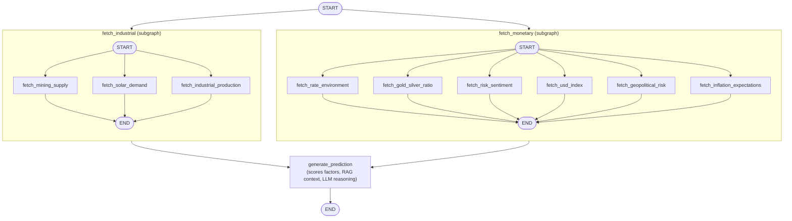

# SilverBot

AI dual-regime silver analyser — an agentic research tool that evaluates silver as both an industrial and a safe-haven asset.

**Live app:** https://silverbot-raj.streamlit.app/

## Stack
- Streamlit (frontend)
- LangGraph + LangChain (agent orchestration, MCP adapters)
- RAG pipeline (FAISS + sentence-transformers embeddings)
- FRED and Yahoo Finance data (fredapi, yfinance)

## Architecture



## Run locally
```bash
pip install -r requirements.txt
streamlit run frontend/app.py
```
